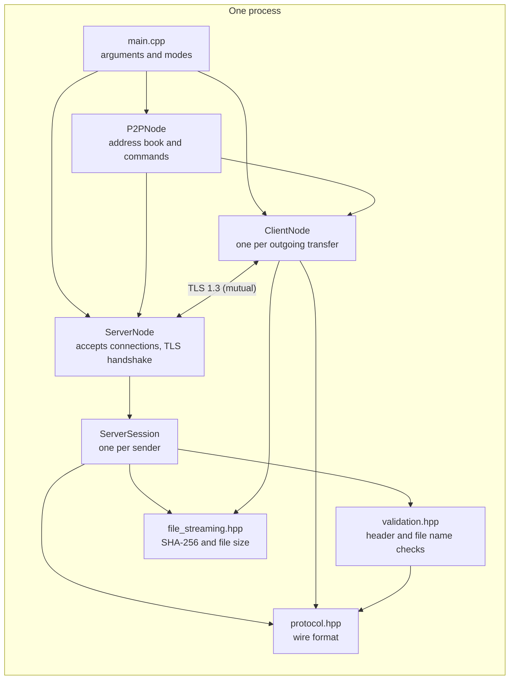
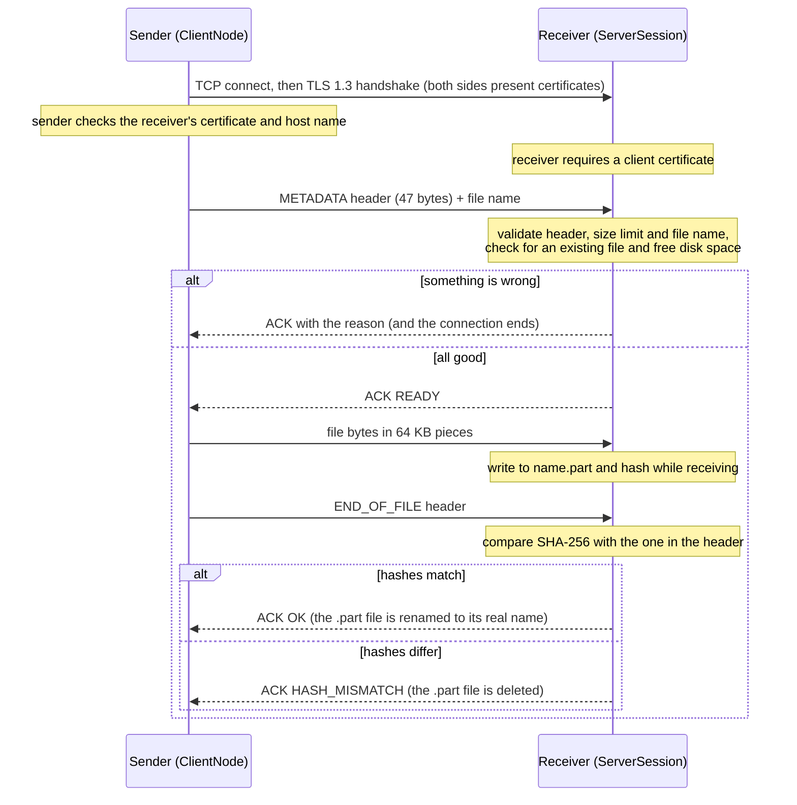

# P2P Secure File Sharing

[](https://github.com/OmarAhmedTHE25th/P2P_Secure_File_Sharing/actions/workflows/ci.yml)
[](LICENSE)


A peer-to-peer file transfer tool written in C++20 with Boost.Asio and OpenSSL. Every connection is TLS 1.3 with **mutual certificate authentication**, every file is **verified end to end with SHA-256**, and everything the receiver accepts from the network is validated before it is trusted.

This is also a security project, so besides how to use it, this README explains how it works, **what it defends against, and what it does not** (see [Threat model](#threat-model) and [Known limitations](#known-limitations)).

## Contents

- [Features](#features)
- [Quick start](#quick-start)
- [Usage](#usage)
- [How it works](#how-it-works)
- [Threat model](#threat-model)
- [Known limitations](#known-limitations)
- [Testing](#testing)
- [Project structure](#project-structure)
- [Roadmap](#roadmap)
- [License](#license)

## Features

- **Mutual TLS 1.3.** Only TLS 1.3 is accepted. The server refuses clients that do not present a certificate, and the client verifies the server's certificate and host name.
- **End-to-end integrity.** The sender hashes the file with SHA-256 and sends the hash in the header. The receiver hashes what it actually wrote and only keeps the file if the two match.
- **Safe receiving.** Files are written to a temporary `.part` file and renamed only after verification. Existing files are never overwritten, and a failed transfer leaves nothing behind.
- **Strict input validation.** Header fields, file sizes and file names are checked against explicit rules before anything touches the disk.
- **Clear refusals.** If the receiver says no, it says why (name not allowed, file too large, already exists, not enough disk space, ...), and the sender only starts streaming after an explicit "ready".
- **Idle timeouts.** Connections that go quiet for 30 seconds are closed.
- **P2P mode.** One process can receive and send at the same time, with an in-memory address book.
- **Progress bars** on both sides.

## Quick start

Tested on Ubuntu 24.04 (including WSL) with GCC 13 and Clang 18. See [Known limitations](#known-limitations) for platforms I have not tested.

```bash
# 1. Dependencies (Debian/Ubuntu)
sudo apt install build-essential cmake libboost-dev libboost-system-dev libssl-dev

# 2. Get the code
git clone https://github.com/OmarAhmedTHE25th/P2P_Secure_File_Sharing.git
cd P2P_Secure_File_Sharing

# 3. Create a development certificate (see "Certificates" below)
bash scripts/gen_certs.sh

# 4. Build
cmake -S . -B build
cmake --build build
```

Then try a transfer on one machine, in two terminals, from inside the `build` folder:

```bash
# terminal 1
cd build
./P2P_Secure_File_Sharing receive 8080

# terminal 2
cd build
echo "hello" > test.txt
./P2P_Secure_File_Sharing send localhost 8080 test.txt
```

The sender should end with `Receiver confirmed: file verified and saved!`, and `test.txt` appears in the receiver's `received/` folder.

### Certificates

The program reads `server.crt` and `server.key` from the **directory it is run from**. CMake copies them next to the executable when you configure the project, so generate them *before* running CMake (or re-run CMake afterwards).

`scripts/gen_certs.sh` creates a self-signed development certificate valid for `localhost` and `127.0.0.1`. To use it between two machines, add the address the sender will connect to, because the sender checks the host name against the certificate:

```bash
bash scripts/gen_certs.sh --force 192.168.1.20 my-laptop.local
```

Then give **both** machines the same `server.crt` **and** `server.key` (see [Known limitations](#known-limitations) for why, and why that is a big deal). The certificate and key are listed in `.gitignore`: never commit a private key.

## Usage

```
P2P_Secure_File_Sharing receive <port> [save_folder]
P2P_Secure_File_Sharing send <host> <port> <file>
P2P_Secure_File_Sharing p2p <port> [save_folder]
```

| Mode | What it does |
|------|--------------|
| `receive` | Listens on `<port>` and saves incoming files to `save_folder` (default `received`). Handles several senders at once. |
| `send` | Sends one file to `<host>:<port>` and exits. |
| `p2p` | Listens like `receive` *and* gives you a prompt to send files. |

**Commands in `p2p` mode:**

| Command | Meaning |
|---------|---------|
| `add <name> <host> <port>` | Remember a peer under a name (kept in memory only, lost on exit) |
| `send_to <name> <file>` | Send a file to a remembered peer (file path without spaces) |
| `send <host> <port> "<file>"` | Send to an address directly (quote paths that contain spaces) |
| `exit` | Quit |

Two nodes on one machine (use different ports and different save folders):

```bash
# terminal 1
./P2P_Secure_File_Sharing p2p 8080 received-a

# terminal 2
./P2P_Secure_File_Sharing p2p 8081 received-b
> add alice localhost 8080
> send_to alice test.txt
```

## How it works

### Architecture



Everything runs on Boost.Asio's asynchronous I/O. `ServerNode` accepts a connection, completes the TLS handshake, and hands the connection to a new `ServerSession`, then immediately goes back to accepting. Each session is its own small state machine, so several senders can upload at once. `validation.hpp` is deliberately plain functions with no sockets or disk access, which is what makes it easy to unit test and fuzz.

### A transfer, step by step



### Wire format

Every control message is a fixed **47-byte header**; all numbers are big-endian.

| Offset | Size | Field | Meaning |
|-------:|-----:|-------|---------|
| 0 | 1 | `msg_type` | `0x01` METADATA, `0x02` CHUNK (reserved, not used on the wire), `0x03` END_OF_FILE, `0x04` ACK |
| 1 | 4 | `payload_len` | Bytes that follow the header (for METADATA: the file name length) |
| 5 | 8 | `total_file_size` | File size in bytes |
| 13 | 2 | `filename_len` | File name length |
| 15 | 32 | `file_hash` | SHA-256 of the whole file |

- After a METADATA header comes the file name, then (once the receiver says READY) exactly `total_file_size` raw bytes of file data.
- An ACK is a header with `payload_len = 1` followed by **one status byte**: `0` OK, `1` HASH_MISMATCH, `2` SERVER_ERROR, `3` READY, `4` BAD_REQUEST, `5` FILE_TOO_LARGE, `6` UNSAFE_FILENAME, `7` ALREADY_EXISTS, `8` NO_SPACE.

## Threat model

### What is protected

- **Confidentiality and integrity of files in transit**, against anyone watching or tampering with the network.
- **The receiver's disk and file system**, against a malicious or buggy sender.
- **The receiver's availability**, against some (not all) resource-exhaustion tricks.

### Who the attacker is

1. **A network attacker** who can read, modify, drop or inject traffic between two peers, but does **not** have the certificate and private key.
2. **A malicious sender** who can reach the receiver's port and speaks the protocol (or garbage) on purpose.
3. **A malicious receiver**, trying to make a sender send the wrong thing or hang.

### Threats and mitigations

| Threat | Mitigation | Checked by |
|--------|------------|------------|
| Eavesdropping on a transfer | TLS 1.3 only (a TLS 1.2 client is refused) | End-to-end test, tried by hand |
| Tampering with data in transit | TLS integrity protection, plus the SHA-256 comparison at the end (a wrong hash gets `HASH_MISMATCH` and no file is kept) | Unit tests (hashing), end-to-end test, tried by hand |
| Impersonating the receiver (man in the middle) | Sender verifies the receiver's certificate against the trusted `server.crt` **and** checks the host name | Tried by hand: connecting through an address the certificate does not list fails the handshake |
| A stranger connecting to a receiver | Receiver requires a client certificate and verifies it | Tried by hand: no certificate, or a different self-signed one, is refused |
| **Path traversal** (`../../x`, `/etc/passwd`, `C:\x`) | File names are accepted only by explicit rules: no path separators, no `:`, no control characters or NUL | Unit tests, fuzzer |
| Windows tricks (`CON`, `NUL.txt`, `file.txt:hidden` streams, trailing dots and spaces) | Explicit rules, the same on every OS | Unit tests, fuzzer |
| Overwriting an existing file | Existing names (and in-progress `.part` files) are refused | End-to-end test |
| Half-written or corrupt files appearing as real files | Write to `.part`, verify the hash, then rename; deleted on any failure | End-to-end test |
| Claiming a huge file to fill the disk | 10 GB cap per file and a free-space check before accepting | Unit tests (size cap); the free-space check is not tested |
| Malformed or lying headers | Message type, lengths and sizes are validated; `payload_len` must equal `filename_len` | Unit tests, fuzzer |
| Memory-safety bugs in the parsing code | Sanitizer builds (ASan, UBSan) run in CI; header and name validation are fuzzed | CI |
| A peer that connects and then goes silent mid-conversation | 30-second idle timeout on both sides | Observed by hand |

### Out of scope (by design)

- Protecting a peer from a **malicious file's contents** (this tool moves bytes, it does not scan them).
- Hiding **that** two peers are talking, or their IP addresses.
- Protecting the machines themselves (malware, someone with root access, stolen disks).

## Known limitations

These are real, and I would rather list them than hide them.

**Authentication is shared, not per peer.** Today the same `server.crt` is both every node's identity and the only certificate every node trusts. In practice all peers must share one certificate **and private key**. That means:
- Anyone who has the key is indistinguishable from any legitimate peer, and can also impersonate any peer to any other.
- There is no way to revoke a single peer.
- The receiver prints the peer's certificate fingerprint, but never compares it to anything, so there is no pinning or trust-on-first-use yet.

Treat it as "a group of friends who trust each other with one key", not as strong per-user identity. Per-peer certificates and fingerprint pinning are the top roadmap item.

**Denial of service is only partly handled.**
- The TLS handshake itself has no timeout, so a client that connects and never finishes it can hold a connection open. The 30-second timer only starts once the handshake is done.
- There is no cap on the number of simultaneous connections and no rate limiting.
- Each upload checks free disk space on its own, so several uploads at once can pass the check individually and still fill the disk together.
- An aborted upload can leave its `.part` file in place until the 30-second idle timer fires. In my test runs it was removed after roughly 26 to 32 seconds.

**File names.** The rules block dangerous characters, but file names are not checked for valid UTF-8 or Unicode normalization, and I have not tested non-ASCII names on Windows. Names starting with `.` and names longer than 200 bytes are refused on purpose.

**Smaller things.**
- The address book lives in memory and is lost when you exit.
- The server's progress bar uses shared state, so simultaneous uploads garble each other's bar (it is cosmetic).
- In `p2p` mode the command prompt runs on a second thread that starts transfers. I have not run a ThreadSanitizer pass on that yet.
- No resume of interrupted transfers, and no folder transfers.
- The development certificate script uses RSA-2048 and expires after 365 days.

**Platforms.** CI covers Ubuntu with GCC and Clang. I have developed it under WSL; native Windows (MSVC) and macOS builds are untested.

## Testing

| What | How | What it covers |
|------|-----|----------------|
| **Unit tests** (35, GoogleTest) | `ctest --test-dir build` | Header layout, SHA-256 against known vectors (including file sizes right on the 64 KB chunk boundary), header validation limits, and the file name rules |
| **End-to-end test** | `ctest --test-dir build` (Linux) | Starts a real receiver and sends real files over TLS: random 500 KB, 1 byte, empty, a name with a space. Checks byte-for-byte equality, and that duplicates and `CON.txt` are refused and leave nothing behind |
| **Sanitizers** | `cmake -S . -B build-san -DCMAKE_BUILD_TYPE=Debug -DP2P_SANITIZE=ON`, then build and `ctest` | All of the above with AddressSanitizer and UndefinedBehaviorSanitizer; any memory error or undefined behavior fails the run |
| **Fuzzing** (libFuzzer) | see below | Header checks and file name sanitizer: random inputs are checked against rules that must hold for every input |

Run everything:

```bash
bash scripts/gen_certs.sh
cmake -S . -B build
cmake --build build
ctest --test-dir build --output-on-failure
```

Fuzz for a minute (needs Clang):

```bash
sudo apt install clang libclang-rt-dev
cmake -S . -B build-fuzz -DCMAKE_CXX_COMPILER=clang++ -DP2P_BUILD_TESTS=OFF -DP2P_BUILD_FUZZERS=ON
cmake --build build-fuzz --target fuzz_validation
mkdir -p corpus-work
./build-fuzz/fuzz_validation corpus-work fuzz/seeds -max_total_time=60
```

If the fuzzer finds an input that breaks a rule, it prints `PROPERTY VIOLATED: <rule>` and saves the input as `crash-<hash>`; replay it with `./build-fuzz/fuzz_validation crash-<hash>`.

Some security behavior is only **checked by hand so far**, not automated: a TLS 1.2 client is refused, a client with no certificate or with a different self-signed certificate is refused, a sender refuses a receiver whose certificate does not list the address it connected to, and a file sent with a wrong hash gets `HASH_MISMATCH` and leaves nothing on disk. Turning these into automated tests is on the roadmap.

To make sure the fuzzer really can find bugs, I planted four on purpose one at a time (allowing `:` in names, dropping the length-match check, dropping the trailing-dot rule, dropping `CON` from the reserved list), and it caught each one within seconds. The fuzzer covers the validation logic only, not the network state machine.

GitHub Actions runs three jobs on every push: build and test (GCC and Clang), sanitizers, and a 60-second fuzz run.

## Project structure

```
main.cpp              Entry point, argument parsing, TLS context setup
p2p_node.hpp          Interactive P2P node: address book and commands
server_node.hpp       Accepts connections and performs the TLS handshake
server_session.hpp    Receiving state machine, one per incoming connection
client_node.hpp       Sending state machine, one per outgoing transfer
validation.hpp        Pure header checks and file name rules (unit tested, fuzzed)
protocol.hpp          Wire format and status codes
file_streaming.hpp    SHA-256 hashing and file size
tests/                Unit tests (GoogleTest)
fuzz/                 libFuzzer harness and seed inputs
scripts/gen_certs.sh  Generates a development certificate
scripts/e2e_test.sh   End-to-end transfer test
.github/workflows/    CI: build and test, sanitizers, fuzzing
```

## Roadmap

- Per-peer certificates with fingerprint pinning (trust on first use, like SSH `known_hosts`), replacing the single shared identity
- Handshake timeout and a cap on concurrent connections
- Automated tests for the security behavior that is currently checked by hand
- A global disk-space reservation so parallel uploads cannot fill the disk together
- Persistent address book
- Resume interrupted transfers; send folders
- UTF-8 validation for file names, and testing on Windows
- A ThreadSanitizer pass over `p2p` mode, and Windows and macOS builds in CI

## License

MIT, see [LICENSE](LICENSE).