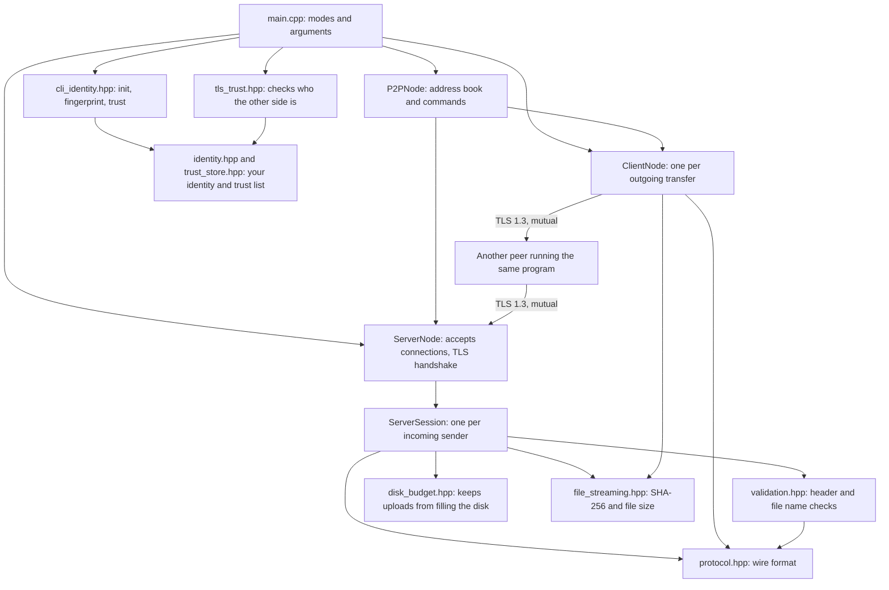
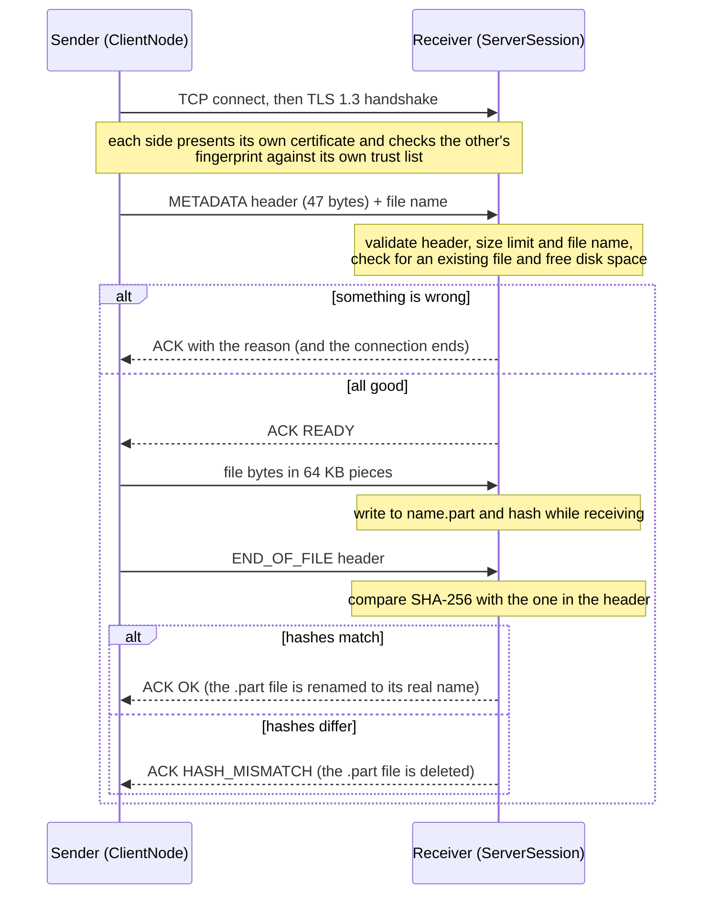

# P2P Secure File Sharing

[](https://github.com/OmarAhmedTHE25th/P2P_Secure_File_Sharing/actions/workflows/ci.yml)
[](LICENSE)


A peer-to-peer file transfer tool written in C++20 with Boost.Asio and OpenSSL. Every connection is TLS 1.3 where **both sides prove who they are**: each node has its own identity, and only talks to peers whose fingerprint it was told to trust. Every file is **verified end to end with SHA-256**, and everything the receiver accepts from the network is validated before it is trusted.

This is also a security project, so besides how to use it, this README explains how it works, **what it defends against, and what it does not** (see [Threat model](#threat-model) and [Known limitations](#known-limitations)).

## Contents

- [Features](#features)
- [Quick start](#quick-start)
- [Usage](#usage)
- [How it works](#how-it-works)
- [Threat model](#threat-model)
- [Known limitations](#known-limitations)
- [Testing](#testing)
- [Project structure](#project-structure)
- [Roadmap](#roadmap)
- [License](#license)

## Features

- **Mutual TLS 1.3 with per-peer identities.** Only TLS 1.3 is accepted. Every node has its own key and certificate, and both sides check the other's fingerprint.
- **Trust you control.** Each node keeps its own trust list of peer fingerprints (like SSH's `known_hosts`). Take a peer off the list and they are cut off at once, without restarting anything and without affecting anyone else.
- **End-to-end integrity.** The sender hashes the file with SHA-256 and sends the hash in the header. The receiver hashes what it actually wrote and only keeps the file if the two match.
- **Disk protection.** Every upload reserves its space from one shared budget, so parallel uploads cannot fill the disk together, and 100 MiB is always left free.
- **Safe receiving.** Files are written to a temporary `.part` file and renamed only after verification. Existing files are never overwritten, and a failed transfer leaves nothing behind.
- **Strict input validation.** Header fields, file sizes and file names are checked against explicit rules before anything touches the disk.
- **Clear refusals.** If the receiver says no, it says why (name not allowed, file too large, already exists, not enough disk space, ...), and the sender only starts streaming after an explicit "ready".
- **Timeouts and limits.** A peer gets 10 seconds to finish the TLS handshake, connections that go quiet for 30 seconds are closed, and the receiver accepts at most 64 connections at once.
- **P2P mode.** One process can receive and send at the same time, with an in-memory address book.
- **Progress bars** on both sides.

## Quick start

Tested on Ubuntu 24.04 (including WSL) with GCC 13 and Clang 18. See [Known limitations](#known-limitations) for platforms I have not tested.

```bash
# 1. Dependencies (Debian/Ubuntu)
sudo apt install build-essential cmake libboost-dev libboost-system-dev libssl-dev

# 2. Get the code
git clone https://github.com/OmarAhmedTHE25th/P2P_Secure_File_Sharing.git
cd P2P_Secure_File_Sharing

# 3. Build
cmake -S . -B build
cmake --build build
```

Every node has its own **identity**, and only talks to peers whose **fingerprint** it was told to trust (see [Identity and trust](#identity-and-trust)). To try it on one machine, play two people, Alice and Bob, each in their own folder inside `build`:

```bash
cd build
mkdir alice bob

# each person creates their own identity (once)
(cd alice && ../P2P_Secure_File_Sharing init alice)
(cd bob   && ../P2P_Secure_File_Sharing init bob)

# each person trusts the other. On two real machines you would send each other your
# fingerprint through a channel you trust; here we just read it from the other folder.
(cd alice && ../P2P_Secure_File_Sharing trust add "$(cd ../bob && ../P2P_Secure_File_Sharing fingerprint | sed 's/^Your fingerprint: //')" bob)
(cd bob && ../P2P_Secure_File_Sharing trust add "$(cd ../alice && ../P2P_Secure_File_Sharing fingerprint | sed 's/^Your fingerprint: //')" alice)
```

Then send a file, in two terminals:

```bash
# terminal 1: Alice receives
cd build/alice
../P2P_Secure_File_Sharing receive 8080

# terminal 2: Bob sends
cd build/bob
echo "hello" > test.txt
../P2P_Secure_File_Sharing send localhost 8080 test.txt
```

The sender should end with `Receiver confirmed: file verified and saved!`, and `test.txt` appears in `build/alice/received/`.

### Identity and trust

- `init [--force] [name]` creates `identity.key` (your private key: keep it secret and never commit it) and `identity.crt` in the current folder, and prints your **fingerprint**: a short code (the SHA-256 of your certificate) that identifies you.
- Give your fingerprint to the people you want to exchange files with **through a channel you trust** (a call, or a message you know is really from them), and get theirs the same way. That check is the whole point: you trust someone because you checked, not because they showed up.
- `trust add <fingerprint> <name>` puts a peer on your trust list (`trusted_peers.txt`, one line per peer), `trust list` shows it, and `trust remove <name>` takes a peer off.
- Both sides check each other: a receiver only accepts senders on its list, and a sender only sends to receivers on its own. If a peer is refused, the program prints that peer's fingerprint and the exact `trust add` command to use once you have checked it.
- The list is re-read on every connection, so changes take effect immediately.
- `fingerprint` shows your own fingerprint again.

The program looks for `identity.crt`, `identity.key` and `trusted_peers.txt` in the **folder you run it from**. An identity does not depend on a host name or IP address, so nothing needs regenerating when an address changes.

## Usage

```
P2P_Secure_File_Sharing receive <port> [save_folder]
P2P_Secure_File_Sharing send <host> <port> <file>
P2P_Secure_File_Sharing p2p <port> [save_folder]

P2P_Secure_File_Sharing init [--force] [name]
P2P_Secure_File_Sharing fingerprint
P2P_Secure_File_Sharing trust add <fingerprint> <name>
P2P_Secure_File_Sharing trust list
P2P_Secure_File_Sharing trust remove <name|fingerprint>
```

| Mode | What it does |
|------|--------------|
| `receive` | Listens on `<port>` and saves incoming files to `save_folder` (default `received`). Handles several senders at once. |
| `send` | Sends one file to `<host>:<port>` and exits. The exit status is 0 only if the receiver confirmed the file was verified and saved, so scripts can rely on it. |
| `p2p` | Listens like `receive` *and* gives you a prompt to send files. |

**Commands in `p2p` mode:**

| Command | Meaning |
|---------|---------|
| `add <name> <host> <port>` | Remember a peer's address under a name (kept in memory only, lost on exit; this is separate from the trust list) |
| `send_to <name> <file>` | Send a file to a remembered peer (file path without spaces) |
| `send <host> <port> "<file>"` | Send to an address directly (quote paths that contain spaces) |
| `exit` | Quit |

Two nodes on one machine (different ports, different save folders, each in its own folder with its own identity and trust list):

```bash
# terminal 1 (in alice's folder)
../P2P_Secure_File_Sharing p2p 8080 received

# terminal 2 (in bob's folder)
../P2P_Secure_File_Sharing p2p 8081 received
> add alice localhost 8080
> send_to alice test.txt
```

## How it works

### Architecture



Everything runs on Boost.Asio's asynchronous I/O. `tls_trust.hpp` is what turns an ordinary TLS handshake into one that checks fingerprints against your trust list; `main.cpp` sets it up and hands the result to the nodes. `ServerNode` accepts a connection, completes the TLS handshake, and hands the connection to a new `ServerSession`, then immediately goes back to accepting. Each session is its own small state machine, so several senders can upload at once. `validation.hpp` is deliberately plain functions with no sockets or disk access, which is what makes it easy to unit test and fuzz.

### A transfer, step by step



### Wire format

Every control message is a fixed **47-byte header**; all numbers are big-endian.

| Offset | Size | Field | Meaning |
|-------:|-----:|-------|---------|
| 0 | 1 | `msg_type` | `0x01` METADATA, `0x02` CHUNK (reserved, not used on the wire), `0x03` END_OF_FILE, `0x04` ACK |
| 1 | 4 | `payload_len` | Bytes that follow the header (for METADATA: the file name length) |
| 5 | 8 | `total_file_size` | File size in bytes |
| 13 | 2 | `filename_len` | File name length |
| 15 | 32 | `file_hash` | SHA-256 of the whole file |

- After a METADATA header comes the file name, then (once the receiver says READY) exactly `total_file_size` raw bytes of file data.
- An ACK is a header with `payload_len = 1` followed by **one status byte**: `0` OK, `1` HASH_MISMATCH, `2` SERVER_ERROR, `3` READY, `4` BAD_REQUEST, `5` FILE_TOO_LARGE, `6` UNSAFE_FILENAME, `7` ALREADY_EXISTS, `8` NO_SPACE.

## Threat model

### What is protected

- **Confidentiality and integrity of files in transit**, against anyone watching or tampering with the network.
- **The receiver's disk and file system**, against a malicious or buggy sender.
- **The receiver's availability**, against some (not all) resource-exhaustion tricks.

### Who the attacker is

1. **A network attacker** who can read, modify, drop or inject traffic between two peers, but does **not** have the private key of any peer you trust.
2. **A malicious sender** who can reach the receiver's port and speaks the protocol (or garbage) on purpose.
3. **A malicious receiver**, trying to make a sender send the wrong thing or hang.

### Threats and mitigations

| Threat | Mitigation | Checked by |
|--------|------------|------------|
| Eavesdropping on a transfer | TLS 1.3 only (a TLS 1.2 client is refused) | End-to-end test |
| Tampering with data in transit | TLS integrity protection, plus the SHA-256 comparison at the end (a wrong hash gets `HASH_MISMATCH` and no file is kept) | Unit tests (hashing), end-to-end test |
| Impersonating a receiver (man in the middle) | The sender only talks to a receiver whose certificate fingerprint is on its own trust list; anything else is refused before a single byte of the file is sent | Unit tests (decision logic), end-to-end test |
| A stranger connecting to a receiver | The receiver requires the sender to present a certificate and only accepts fingerprints on its trust list; expired or unusable certificates are refused even if trusted | Unit tests (decision logic), end-to-end test |
| A trusted peer turns out to be bad, or loses its key | Remove its line from your trust list: it is cut off at once, without restarting anything and without affecting anyone else | End-to-end test |
| **Path traversal** (`../../x`, `/etc/passwd`, `C:\x`) | File names are accepted only by explicit rules: no path separators, no `:`, no control characters or NUL | Unit tests, fuzzer |
| Windows tricks (`CON`, `NUL.txt`, `file.txt:hidden` streams, trailing dots and spaces) | Explicit rules, the same on every OS | Unit tests, fuzzer |
| Overwriting an existing file | Existing names (and in-progress `.part` files) are refused | End-to-end test |
| Half-written or corrupt files appearing as real files | Write to `.part`, verify the hash, then rename; deleted on any failure | End-to-end test |
| Claiming a huge file, or many files at once, to fill the disk | 10 GB cap per file, a shared disk budget that every upload must reserve its space from, and 100 MiB always kept free | Unit tests (size cap and disk budget); tried by hand on a real 20 MB disk |
| Malformed or lying headers | Message type, lengths and sizes are validated; `payload_len` must equal `filename_len` | Unit tests, fuzzer |
| Memory-safety bugs in the parsing code | Sanitizer builds (ASan, UBSan) run in CI; header and name validation are fuzzed | CI |
| A peer that connects and goes silent, or that opens a flood of connections | 10-second handshake timeout, 30-second idle timeout on both sides, and at most 64 simultaneous connections on the receiver | End-to-end test (limit and handshake timeout); idle timeout observed by hand |

### Out of scope (by design)

- Protecting a peer from a **malicious file's contents** (this tool moves bytes, it does not scan them).
- Hiding **that** two peers are talking, or their IP addresses.
- Protecting the machines themselves (malware, someone with root access, stolen disks).

## Known limitations

**Trust is only as good as the fingerprint you add.**
- Nothing is trusted automatically. If you add a fingerprint you did not really check with its owner (or an attacker swapped the one you were given), you now trust the attacker. There is deliberately no "trust on first use" for receivers, because that would mean accepting any stranger.
- The private key (`identity.key`) is stored unencrypted, protected only by file permissions. Anyone who copies it can pretend to be you to everyone who trusts you. If that happens, run `init --force` and give everyone your new fingerprint.
- An identity cannot be renewed in place: certificates are valid for ten years, an expired one is refused, and a new identity means a new fingerprint that everyone has to trust again.
- A trusted peer is trusted from any address (the fingerprint is the identity, not the host name). That is intended, but it means a trusted peer's key is all an attacker needs.
- A sender that a receiver does not trust only sees a closed connection plus a hint (a TLS 1.3 detail: the sender's side of the handshake finishes before the receiver checks it). The receiver's log has the full explanation.
- Every refused connection is logged in full, so a flood of refused connections makes a noisy log.

**Denial of service is only partly handled.**
- The 64-connection limit and the 10-second handshake timeout are global, not per address. One machine that keeps reconnecting can still fill every seat and lock other peers out. There is no per-address limit and no rate limiting.
- The disk budget only accounts for this program's own uploads. Another program writing to the same disk at the same time can still use up space the budget was counting on.
- An aborted upload can leave its `.part` file in place until the 30-second idle timer fires. In my test runs it was removed after roughly 26 to 32 seconds.

**File names.** The rules block dangerous characters, but file names are not checked for valid UTF-8 or Unicode normalization, and I have not tested non-ASCII names on Windows. Names starting with `.` and names longer than 200 bytes are refused on purpose.

**Smaller things.**
- The address book lives in memory and is lost when you exit.
- The server's progress bar uses shared state, so simultaneous uploads garble each other's bar (it is cosmetic).
- In `p2p` mode the command prompt runs on a second thread that starts transfers. I have not run a ThreadSanitizer pass on that yet.
- No resume of interrupted transfers, and no folder transfers.
- The identity files and the trust list are looked up in the folder you run the program from (there is no per-user config folder yet).

**Platforms.** CI covers Ubuntu with GCC and Clang. I have developed it under WSL; native Windows (MSVC) and macOS builds are untested.

## Testing

| What | How | What it covers |
|------|-----|----------------|
| **Unit tests** (87, GoogleTest) | `ctest --test-dir build` | Header layout, SHA-256 against known vectors (including file sizes right on the 64 KB chunk boundary), header validation limits, the file name rules, the disk budget (parallel uploads, release on finish, free-space margin), identity creation (keys, certificates, permissions), the trust list file and its edge cases, and the decision that accepts or refuses a peer's certificate |
| **End-to-end test** | `ctest --test-dir build` (Linux) | Four separate identities talking over real TLS on localhost: a trusted sender's files arrive byte-identical (random 500 KB, 1 byte, empty, a name with a space); duplicates and `CON.txt` are refused and leave nothing behind; a sender the receiver does not trust is refused, and a sender refuses a receiver it does not trust; removing a peer from the trust list cuts them off without restarting the receiver; a TLS 1.2 client is refused; a wrong hash gets `HASH_MISMATCH`; connections beyond the limit are dropped and a silent peer is hung up on (this test takes about 15 seconds) |
| **Sanitizers** | `cmake -S . -B build-san -DCMAKE_BUILD_TYPE=Debug -DP2P_SANITIZE=ON`, then build and `ctest` | All of the above with AddressSanitizer and UndefinedBehaviorSanitizer; any memory error or undefined behavior fails the run |
| **Fuzzing** (libFuzzer) | see below | Header checks and file name sanitizer: random inputs are checked against rules that must hold for every input |

Run everything:

```bash
cmake -S . -B build
cmake --build build
ctest --test-dir build --output-on-failure
```

Fuzz for a minute (needs Clang):

```bash
sudo apt install clang libclang-rt-dev
cmake -S . -B build-fuzz -DCMAKE_CXX_COMPILER=clang++ -DP2P_BUILD_TESTS=OFF -DP2P_BUILD_FUZZERS=ON
cmake --build build-fuzz --target fuzz_validation
mkdir -p corpus-work
./build-fuzz/fuzz_validation corpus-work fuzz/seeds -max_total_time=60
```

If the fuzzer finds an input that breaks a rule, it prints `PROPERTY VIOLATED: <rule>` and saves the input as `crash-<hash>`; replay it with `./build-fuzz/fuzz_validation crash-<hash>`.

Two things are only **checked by hand so far**, not automated: two simultaneous uploads onto a disk too small for both get one accepted and one refused (it needs a tiny real disk), and the 30-second idle timeout. Everything else in the threat table is covered by an automated test.

To make sure the fuzzer really can find bugs, I planted four on purpose one at a time (allowing `:` in names, dropping the length-match check, dropping the trailing-dot rule, dropping `CON` from the reserved list), and it caught each one within seconds. The fuzzer covers the validation logic only, not the network state machine.

GitHub Actions runs three jobs on every push: build and test (GCC and Clang), sanitizers, and a 60-second fuzz run.

## Project structure

```
main.cpp              Entry point and argument parsing
cli_identity.hpp      The init, fingerprint and trust commands
identity.hpp          Creates your key and certificate, computes fingerprints
trust_store.hpp       The trust list file (fingerprints you trust)
tls_trust.hpp         Makes the TLS handshake check fingerprints against the trust list
p2p_node.hpp          Interactive P2P node: address book and commands
server_node.hpp       Accepts connections and performs the TLS handshake
server_session.hpp    Receiving state machine, one per incoming connection
client_node.hpp       Sending state machine, one per outgoing transfer
validation.hpp        Pure header checks and file name rules (unit tested, fuzzed)
disk_budget.hpp       Shared disk-space budget for uploads in progress
protocol.hpp          Wire format and status codes
file_streaming.hpp    SHA-256 hashing and file size
tests/                Unit tests (GoogleTest)
fuzz/                 libFuzzer harness and seed inputs
scripts/e2e_test.sh   End-to-end transfer test
.github/workflows/    CI: build and test, sanitizers, fuzzing
```

## Roadmap

- Protect the private key with a passphrase
- Optional trust-on-first-use for senders (like SSH `known_hosts`), with an explicit prompt
- Identity and trust list in a per-user config folder; trust commands inside the `p2p` prompt
- Per-address connection limits and rate limiting
- An automated test for disk-full behavior, using a tiny real disk
- Persistent address book
- Resume interrupted transfers; send folders
- UTF-8 validation for file names, and testing on Windows
- A ThreadSanitizer pass over `p2p` mode, and Windows and macOS builds in CI

## License

MIT, see [LICENSE](LICENSE).
